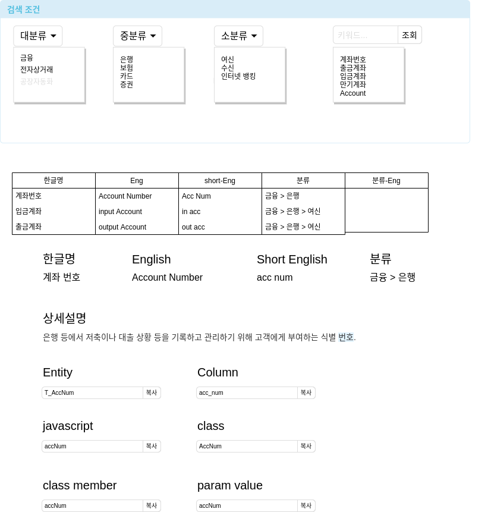

# data-dictionary
Project standard word management program

## Application Framework
- back end  : ruby on rails
- front end : vue && vuetify

## proejct create
```
// back-end
rails new back-end --api
// fornt-end
vue crate front-end
vue add vuetify
```
---
## User requirement
- card-01 : When a word is searched, the meaning of the word and variables by language are searched.


